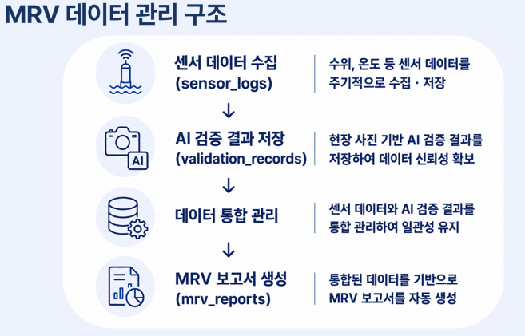
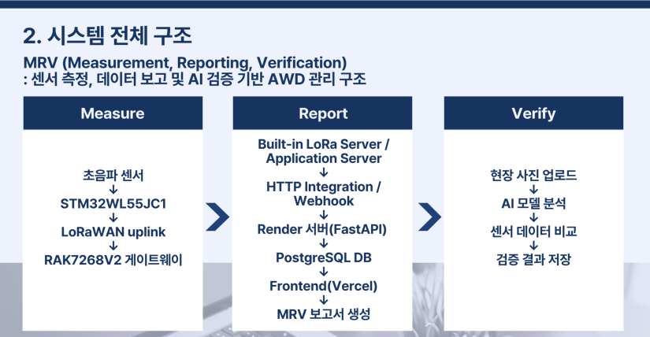
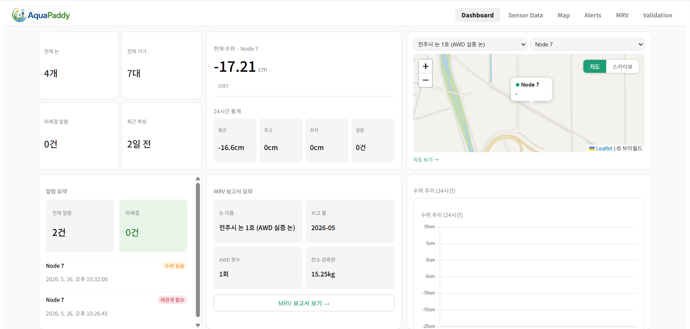
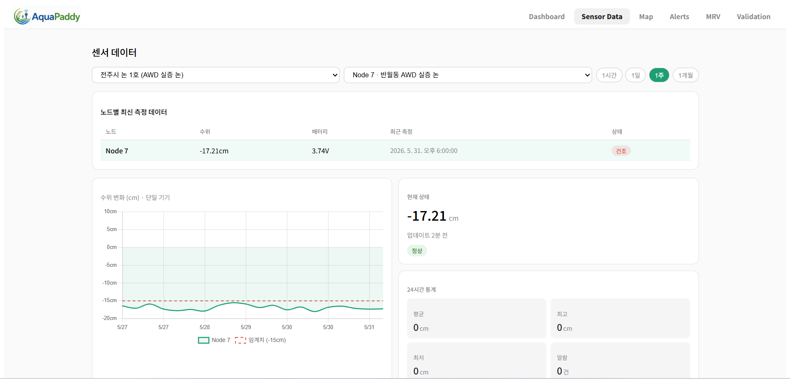
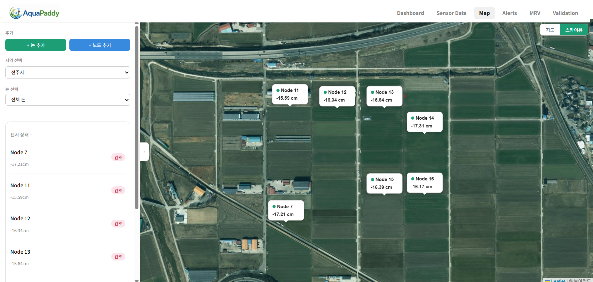
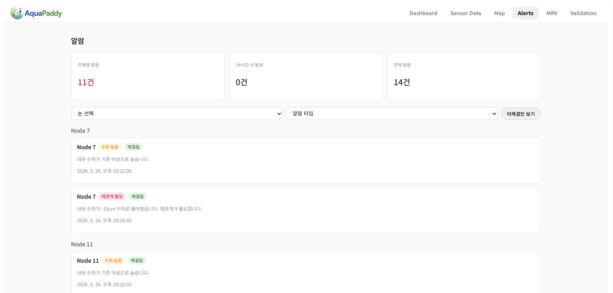
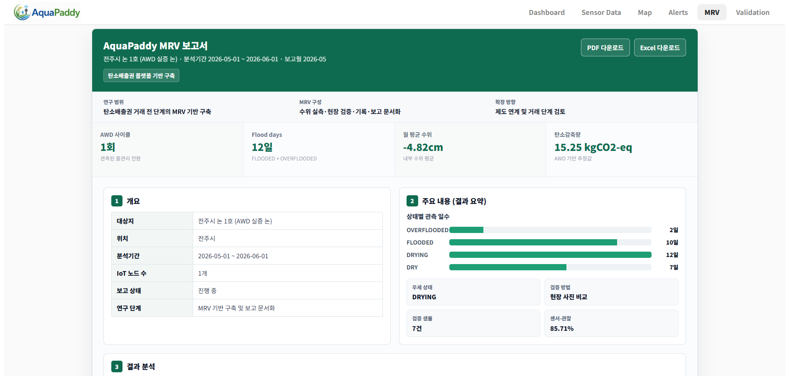
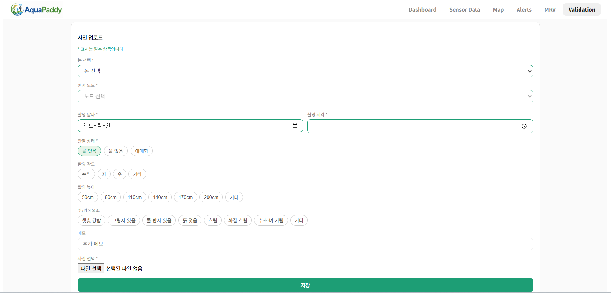
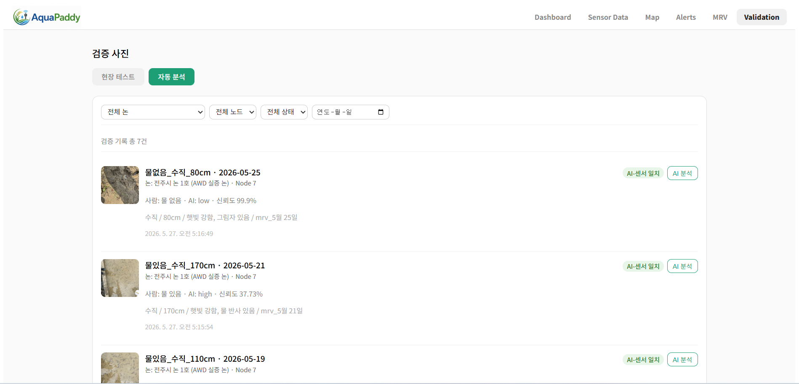
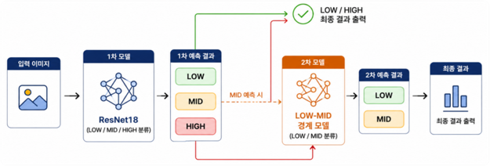

# 🌾 AI 기반 AWD 논 수위 모니터링 및 MRV 자동화 시스템

Gold Standard AWD 기반 논 물관리 데이터 수집·검증·보고 자동화를 위한 IoT + AI 통합 플랫폼


---

## 🌐 IoT · AI · Web 기반 AWD MRV 플랫폼

📅 2026.03 ~ 2026.06

🏫 전북대학교 컴퓨터인공지능학부 캡스톤디자인 프로젝트

🌱 AWD 관리 자동화 및 탄소감축 데이터 기반 구축 연구

📊 MRV(Measurement · Reporting · Verification) 체계 구현 및 탄소배출권 제도 연계를 위한 기반 플랫폼 구축

---

## 🌟 1. 프로젝트 소개

### 🌱 배경
벼농사는 전 세계 메탄(CH₄) 배출의 주요 발생원 중 하나이며, 논을 지속적으로 담수 상태로 유지할 경우 메탄 배출량이 증가합니다. Gold Standard AWD(Alternate Wetting and Drying)는 논을 주기적으로 담수와 배수 상태로 관리하여 메탄 배출을 줄이는 대표적인 물 관리 기법입니다.

### ⚠️ 기존 한계
그러나 실제 농가에서는 수위 측정, AWD 수행 여부 확인, 데이터 기록 및 보고 과정이 대부분 수작업으로 이루어져 관리 부담이 크고 지속적인 운영이 어렵습니다.

### 🎯 프로젝트 목표
이 프로젝트는 IoT 수위 센서, AI 기반 이미지 검증, 웹 기반 MRV(Measurement · Reporting · Verification) 시스템을 활용하여 AWD 관리 과정을 자동화하고 데이터 수집·검증·보고 체계를 구축하는 것을 목표로 합니다. 또한 향후 탄소감축량 산정 및 탄소배출권 제도 연계를 위한 MRV 기반 플랫폼 구축 가능성을 제시합니다.

---

## 🙋‍♂️ 2. 프로젝트 팀

### 👥 팀 소개

전북대학교 컴퓨터인공지능학부 캡스톤디자인 프로젝트 팀으로, IoT·AI·Web 기술을 활용하여 Gold Standard AWD 기반 논 물관리 자동화 및 MRV 플랫폼 구축을 목표로 연구를 수행하였습니다.


### 🌐 강세이 - Frontend 개발 담당
- React 기반 웹 서비스 개발
- Dashboard, Sensor Data, Map, Alert, MRV, Validation 페이지 구현
- 모바일 반응형 UI 구현
- 사용자 인터페이스(UI/UX) 개선
- 현장 실증 및 시스템 테스트 지원

### 🧑‍💻 안수빈 - AI 모델 개발 · Backend
- AWD 논 수위 이미지 데이터 수집 및 라벨링
- ResNet18 기반 AI 수위 분류 모델 및 계층형(Hierarchical) 모델 개발
- FastAPI 기반 Backend API 개발
- MRV 보고서(PDF / Excel) 자동 생성 기능 개발
- 시스템 통합 테스트 및 기능 검증

### 🌐 장주민 - Frontend 개발 담당
- React 기반 웹 서비스 개발
- Dashboard, Sensor Data, Map, Alert, MRV, Validation 페이지 구현
- 모바일 반응형 UI 구현
- 사용자 인터페이스(UI/UX) 개선
- 현장 실증 및 시스템 테스트 지원
- 캡스톤 관련 문서 및 보고서 작성

### 📡 인숙영 - IoT · Database 개발 담당
- STM32WL55JC1 기반 센서 노드 개발
- 초음파 센서 연동 및 LoRaWAN 통신 구현
- Gateway 연동 및 데이터 전송 기능 개발
- PostgreSQL 데이터베이스 설계 및 구축
- FastAPI 기반 Backend API 개발
- 캡스톤 관련 문서 및 보고서 작성

### 🎓 지도교수 및 자문
- 지도교수 : 김윤경 교수 (전북대학교)
- 산학협력 자문 : 최원근 박사 (LX공간정보연구원)

---

## 🏗️ 3. 시스템 개요

이 시스템은 AWD 논의 수위 데이터를 자동으로 수집하고, AI 기반 검증 및 MRV 보고서 생성을 지원하는 IoT · AI · Web 통합 플랫폼입니다.

### 3-1. MRV 프로세스

MRV(Measurement, Reporting, Verification)는 데이터의 측정, 보고, 검증 과정을 의미합니다.


### 3-2. 시스템 아키텍처

IoT 센서에서 수집된 수위 데이터를 LoRaWAN을 통해 서버로 전송하고, 데이터베이스에 저장된 정보를 기반으로 AI 검증 및 MRV 보고서 생성 기능을 제공합니다.


---

## 🚀 4. 주요 기능 및 서비스 화면

### 4-1. AWD 상태 분석 (Dashboard)

수위 데이터를 기반으로 OVERFLOODED, FLOODED, DRYING, DRY 상태를 자동 분석하고 AWD 수행 현황을 시각화합니다.


### 4-2. 실시간 수위 모니터링 (Sensor Data)

초음파 센서를 이용하여 논 수위를 측정하고, 시간별 수위 데이터 및 AWD 상태를 조회할 수 있습니다.


### 4-3. 위치 기반 논 관리 (Map)

논 위치와 센서 노드 정보를 지도 기반으로 시각화하여 관리할 수 있습니다.


### 4-4. 알림 관리 (Alert)

OVERFLOODED , DRY 상태 등 이상 상황 발생 시 경고 알림을 생성하고 관리할 수 있습니다.


### 4-5. MRV 보고서 자동 생성 (MRV Reports)

센서 데이터와 검증 결과를 통합하여 PDF 및 Excel 형태의 MRV 보고서를 자동 생성합니다.


### 4-6. AI 기반 이미지 검증 (Validation)

논 사진을 업로드하면 AI 모델이 LOW / MID / HIGH 상태를 분류하고, 센서 데이터와 비교하여 검증을 수행합니다.



---

## 📂 5. 프로젝트 구조
### 5-1. 전체 프로젝트 구조

```text
backend/               # FastAPI 기반 백엔드 서버
frontend/              # React 기반 웹 서비스
iot/                   # STM32 LoRaWAN 센서 노드
ml/                    # AI 학습 및 추론 코드
data/                  # AWD 수위 이미지 데이터셋
data_boundary_low_mid/ # LOW-MID 경계 데이터셋
```

### 5-2. Backend 구조

```text
backend/
 ┣ app/
 ┃ ┣ api/              # REST API 엔드포인트
 ┃ ┣ models/           # 데이터베이스 모델
 ┃ ┣ schemas/          # 요청/응답 스키마
 ┃ ┣ utils/            # 공통 유틸리티
 ┃ ┗ core/             # 설정 및 DB 연결
 ┣ uploads/            # 업로드 파일 저장
 ┗ requirements.txt    # Python 패키지 목록
```

### 5-3. Frontend 구조

```text
frontend/
 ┣ src/
 ┃ ┣ api/              # API 통신 모듈
 ┃ ┣ components/       # 재사용 UI 컴포넌트
 ┃ ┣ pages/            # 서비스 페이지
 ┃ ┣ hooks/            # 커스텀 훅
 ┃ ┣ data/             # 지역 정보 데이터
 ┃ ┗ styles/           # 전역 스타일
 ┣ public/             # 정적 파일
 ┣ assets/             # 이미지 및 로고
 ┗ main.tsx            # 애플리케이션 진입점
```

### 5-4. IoT 구조

```text
iot/
 ┣ LoRaWAN_End_Node_LBM/ # 메인 LoRaWAN 프로젝트
 ┣ Drivers/              # STM32 드라이버
 ┣ Core/                 # 애플리케이션 코드
 ┗ Middleware/           # LoRaWAN 미들웨어
```

### 5-5. AI 구조

```text
ml/
 ┣ train_water_classifier.py        # 메인 모델 학습
 ┣ train_boundary_low_mid.py        # 경계 모델 학습
 ┣ evaluate_hierarchical_classifier.py # 계층형 모델 평가
 ┣ inference.py                     # 추론 및 예측
 ┣ models/                          # 학습된 모델 저장
 ┣ results/                         # 실험 결과
 ┗ notebooks/                       # 실험 노트북
```


---

## 🤖 6. AI 수위 판별 시스템

### 6-1. 데이터 수집 및 라벨링

실제 논 환경에서 스마트폰(iPhone 13/14)을 이용하여 AWD 수위 이미지를 촬영하였습니다. 

다양한 촬영 높이(10cm, 50cm, 80cm, 110cm, 140cm, 170cm)와 환경 조건(맑음, 흐림, 그림자, 반사)을 반영하여 데이터를 수집하였으며, 수위 0~5cm 구간을 기준으로 LOW, MID, HIGH 클래스로 라벨링하였습니다.

| Class | Water Level |
| ----- | ----------- |
| LOW   | 0~1 cm      |
| MID   | 2~3 cm      |
| HIGH  | 4~5 cm      |

### 6-2. 데이터셋 구조

#### Main Dataset

```text
data/
 ┣ train/ (촬영 높이: 10~110cm)
 ┃ ┣ low/   (수위 0~1cm)
 ┃ ┣ mid/   (수위 2~3cm)
 ┃ ┗ high/  (수위 4~5cm)
 ┃
 ┣ val/ (촬영 높이: 140cm)
 ┃ ┣ low/
 ┃ ┣ mid/
 ┃ ┗ high/
 ┃
 ┗ test/ (촬영 높이: 170cm)
   ┣ low/
   ┣ mid/
   ┗ high/
```

#### LOW-MID Boundary Dataset

LOW와 MID 경계 구간의 오분류를 줄이기 위해 추가 데이터셋을 구성하였습니다.

```text
data_boundary_low_mid/
 ┣ train/ (촬영 높이: 10~110cm)
 ┃ ┣ low/ (수위 0~1cm)
 ┃ ┗ mid/ (수위 2~3cm)
 ┃
 ┣ val/ (촬영 높이: 140cm)
 ┃ ┣ low/
 ┃ ┗ mid/
 ┃
 ┗ test/ (촬영 높이: 170cm)
   ┣ low/
   ┗ mid/
```

### 6-3. 사용 모델

ImageNet으로 사전학습된 ResNet18 모델에 Transfer Learning 및 Fine-tuning을 적용하여 AWD 수위 분류 모델을 구축하였습니다.

### 6-4. 계층형(Hierarchical) 분류 구조

LOW와 MID 구간의 오분류를 줄이기 위해 계층형(Hierarchical) 분류 구조를 적용하였습니다.




### 6-5. 성능 평가
#### 모델 성능

| Model        | Accuracy |
| ------------ | -------- |
| ResNet18     | 86.30%   |
| Hierarchical | 87.67%   |

LOW와 MID 경계 구간에 대해 추가 분류 모델을 적용하여 오분류를 감소시켰으며, 기존 ResNet18 모델 대비 성능이 향상됨을 확인하였습니다.


---

## 🛠️ 7. 기술 스택

| 분야             | 기술                                               |
| -------------- | ------------------------------------------------ |
| Frontend       | React, TypeScript, Vite                          |
| Backend        | FastAPI, SQLAlchemy, PostgreSQL                  |
| AI             | PyTorch, ResNet18                                |
| IoT            | STM32WL55JC1, LoRaWAN, A02YYUW Ultrasonic Sensor |
| Infrastructure | Render, Vercel                                   |

---

## 🏆 8. 주요 성과

### 8-1. 핵심 성과

- AWD 물관리 데이터를 자동으로 수집·기록·관리할 수 있는 MRV 기반 플랫폼 구축
- IoT, AI, Web 기술을 통합한 AWD 관리 자동화 시스템 구현
- 현장 사진 기반 AI 검증 체계 구축
- 향후 탄소감축량 산정 및 탄소배출권 제도 연계를 위한 기반 마련

### 8-2. 시스템 구현 결과

- STM32WL55JC1, LoRaWAN, 초음파 센서를 활용한 수위 측정 시스템 구축
- FastAPI 및 PostgreSQL 기반 데이터 수집·관리 서버 구축
- React 기반 통합 모니터링 웹 서비스 구현
- PDF 및 Excel 형태의 MRV 보고서 자동 생성 기능 구현


### 8-3. AI 기반 검증 체계 구축

- AWD 논 수위 이미지 데이터셋 구축 및 라벨링 수행
- ResNet18 기반 AI 수위 분류 모델 개발
- LOW-MID 경계 구간 개선을 위한 계층형(Hierarchical) 분류 구조 적용
- 최종 정확도 87.67% 달성
- 현장 사진 기반 자동 검증 기능을 웹 서비스에 통합


### 8-4. MRV 자동화 성과

- Measurement : IoT 센서를 활용한 수위 데이터 자동 수집
- Reporting : MRV 보고서 자동 생성
- Verification : AI 기반 현장 사진 검증 자동화

이를 통해 기존 수작업 중심의 AWD 관리 과정을 디지털화하고, MRV 기반 데이터 관리 체계를 구축하였다.

---

## 🔮 9. 향후 개선 방향

- 실제 농가 대상 장기 실증 확대
- 다양한 환경의 AI 데이터셋 확장
- 자동 관개 제어 기능 연계
- 탄소감축량 산정 모델 적용
- 탄소배출권 제도 연계 연구 확장

---

## 🌐 10. 배포 주소

### Frontend
- [Frontend URL](https://jeonbuk-mrv.vercel.app/)

### Backend (Swagger)
- [Backend URL](https://capstone-project-54l6.onrender.com/docs)

---

## 11. 📚 참고 자료

- Gold Standard AWD Methodology (프로젝트 기획 및 AWD 기준 참고)
- LoRaWAN Specification (통신 프로토콜 참고)
- PyTorch Documentation (AI 모델 개발)
- FastAPI Documentation (Backend 개발)

---

## 12. 📄 License

This project was developed for the Capstone Design course at Jeonbuk National University.

Copyright © 2026 Team AquaPaddy. All rights reserved.